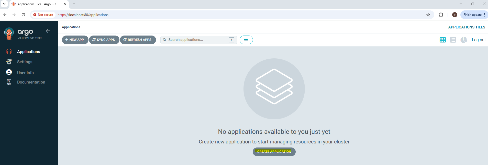

# 1. Deploy [ArcoCD](https://argo-cd.readthedocs.io/en/stable/)


## Create namespace
   ```bash
   kubectl create ns dev
   kubectl create ns argocd
   ```

**Expected Output:**

   ```
    namespace/dev created
    namespace/argocd created
   ```
## Deploy ArcoCD
   ```bash
   helm repo add argo https://argoproj.github.io/argo-helm
   helm repo update
   ```
**Expected Output:**
   ```
    Hang tight while we grab the latest from your chart repositories...
    ...Successfully got an update from the "min" chart repository
    ...Successfully got an update from the "fluxcd-community" chart repository
    ...Successfully got an update from the "ingress-nginx" chart repository
    ...Successfully got an update from the "kyverno" chart repository
    ...Successfully got an update from the "sigstore" chart repository
    ...Successfully got an update from the "grafana" chart repository
    ...Successfully got an update from the "securecodebox" chart repository
    ...Successfully got an update from the "gitlab" chart repository
    ...Successfully got an update from the "bitnami2" chart repository
    ...Successfully got an update from the "bitnami" chart repository
    Update Complete. ⎈Happy Helming!⎈
    "argo" has been added to your repositories

   ```

   ```bash
   helm install argocd argo/argo-cd --namespace argocd 
   ```

**Expected Output:**
   ```
   NAME: argocd
    LAST DEPLOYED: Sun Aug 10 15:17:17 2025
    NAMESPACE: argocd
    STATUS: deployed
    REVISION: 1
    TEST SUITE: None
    NOTES:
    In order to access the server UI you have the following options:

    1. kubectl port-forward service/argocd-server -n argocd 8080:443

    and then open the browser on http://localhost:8080 and accept the certificate

    2. enable ingress in the values file `server.ingress.enabled` and either
      - Add the annotation for ssl passthrough: https://argo-cd.readthedocs.io/en/stable/operator-manual/ingress/#option-1-ssl-passthrough
      - Set the `configs.params."server.insecure"` in the values file and terminate SSL at your ingress: https://argo-cd.readthedocs.io/en/stable/operator-manual/ingress/#option-2-multiple-ingress-objects-and-hosts


    After reaching the UI the first time you can login with username: admin and the random password generated during the installation. You can find the password by running:

    kubectl -n argocd get secret argocd-initial-admin-secret -o jsonpath="{.data.password}" | base64 -d

    (You should delete the initial secret afterwards as suggested by the Getting Started Guide: https://argo-cd.readthedocs.io/en/stable/getting_started/#4-login-using-the-cli)

   ```


# 2. Access ArgoCD


   ```bash
   kubectl port-forward service/argocd-server -n argocd 80:443
   ```

Open https://localhost:80/.

Get password for login:

   ```bash
    kubectl get secret argocd-initial-admin-secret -n argocd -o jsonpath="{.data.password}" | base64 --decode
   ```

Login with username=admin and the initial password.

You should see the following:


# 3. Let ArgoCD manage your App

## create argo project and app

<mark>**IMPORTANT**
Please use your own Git Repository URL including your helm chart. The following is only an example provided by us.
</mark>

You can either add your app 

### via ArgoCD cli:

   ```
    argocd app create apps \
    --dest-namespace argocd \
    --dest-server https://kubernetes.default.svc \
    --repo https://github.com/argoproj/argocd-example-apps.git \
    --path apps  
   ```

### or via ArgoCD UI:

to create a specific project go to settings > projects > + new project

Enter at least the project name and click create.

You should be able to see your created project in the list now.


**Important:**

If you setup GitOps with a private Repository please follow the [official documentation](https://argo-cd.readthedocs.io/en/stable/user-guide/private-repositories/) to configure the credentials for ArgoCD.


Within applications create a new application:




When creating the application within the UI, you can also just copy&paste the [demo-app.yaml](../deployment/demo-app.yaml) when you click on "EDIT AS YAML".

### or run the following commands to create the project and the app: 

   ```bash
   kubectl apply -f ../deployment/demo-project.yaml
   kubectl apply -f ../deployment/demo-app.yaml
   ```

**Expected output:**

App is added:

App is healthy and synced


check which Resources are added by ArgoCD


## Access your application
The application is only available within the Kubernetes Cluster. To Access it run the following command:

   ```bash
    kubectl port-forward svc/if-demo 8080:8080 -n dev
   ```
Open http://localhost:8080.

## Change your application and let ArgoCD sync it

### Steps:
* Change something within your application
* Build a new docker image
* Update the environment specific values.yaml and push your change to the remote repository
* Wait for ArgoCD to regognize the change or manually click on ***Refresh*** so that ArgoCD directly compares the diff between the environment and the git repository.
* Watch ArgoCD moving your application to its desired target state (sync)


